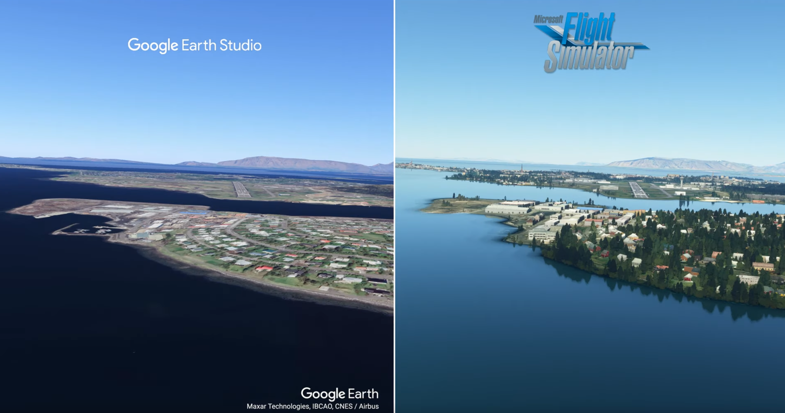
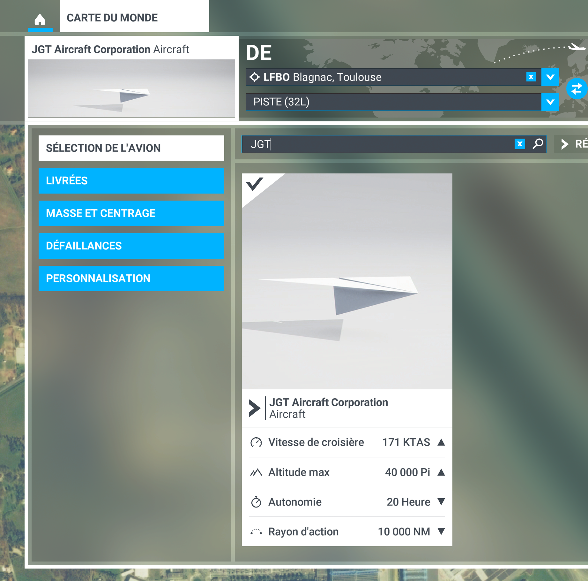

# GeoFlight Replay

GeoFlight Replay can replay and capture scenario from Google Earth Studio (YAML format) in Microsoft Flight Simulator.

<a href="https://www.youtube.com/watch?v=_r16uJmW4Jw">
  
  Video comparing Google Earth Studio and Microsoft Flight Simulator using GeoFlight Replay 
</a>

## Features

- Load, run and capture in YAML scenario in Microsoft Flight Simulator.
- Interactive mode with a menu or script mode for direct execution
- Add 3D objects supported in Microsoft Flight Simulator near the camera (eq plane) position
- For example, position the camera at two predefined positions (LFBO and BIRK airport)
  

    

## Getting Started

- Enable Developper mode : https://docs.flightsimulator.com/html/Developer_Mode/Developer_Mode.htm
- Install Microsoft Flight Simulator SDK : https://docs.flightsimulator.com/html/Introduction/SDK_Overview.htm
- Copy [JGT folder](ressources/JGT) into you Microsoft Flight Simulator Community folder
- Select JGT Aicraft Corporation invsible aircraft :

	

- Start a flight

- Launch GeoFlight Replay :
	-	Interactive mode with an user menu : 
		
		or
		 
	-  Script mode, will launch and capture the provided scenario : python .\geoflight_replay_main.py [your YAML scenario file]. Generated pictures will be in output folder.

## Known limitations
-	Only supports Microsoft Flight Simulator 2020
-	Microsoft Flight Simulator SDK doesnt allow to set directly the camera to a desired postion. To bypass this limitation, GeoFlight Replay sets the position of an invisible aircraft (JGT Aircfrat, delivered in [JGT folder](ressources/JGT)), the camera being attached to the aircraft refernceframe. This trick indirectly sets the camera to a desired location.
-	Microsoft Flight Simulator SDK doesnt allow to peform a screen capture or get a picture from the simulated camera. Picture are generated thanks to the Windows screen capture tool [dxcam](https://pypi.org/project/dxcam/).The generated pictures therefore depend on your screen resolution. If you have a NVIDIA GeForce GPU, you can use DSR technology to bypass this limitation : https://www.nvidia.com/en-us/geforce/technologies/dsr/technology/

  

<code style="">TO BE COMPLETED</code>

